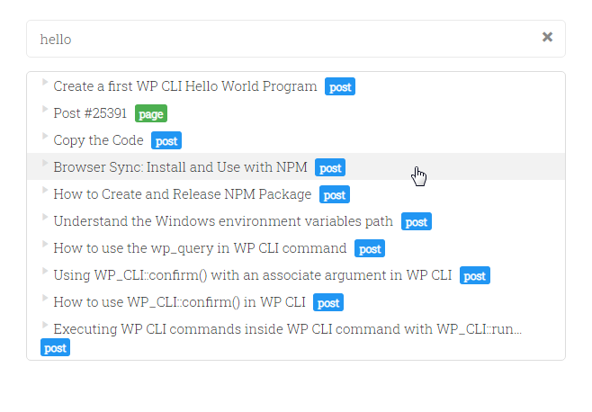

# Easy Search

Zero configuration search box Gutenberg block.

Not using the Gutenberg block editor? Then, Simply use the shortcode <code>[easy_search]</code> anywhere.

Read more at <a href="https://maheshwaghmare.com/doc/easy-search/">getting started guide</a>.